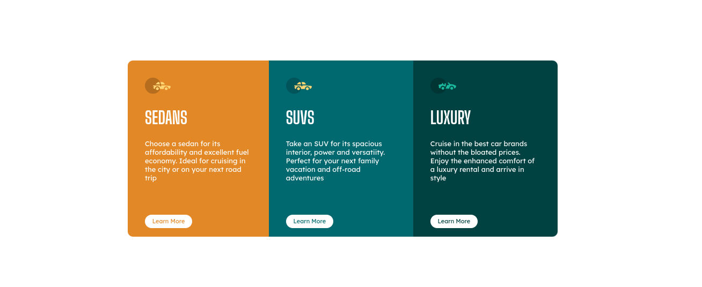
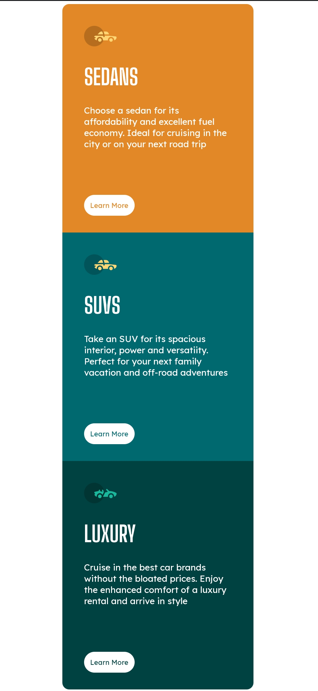

# Car hire advert layout

- [Overview](#overview)
  - [Screenshot](#screenshot)
  - [Links](#links)
- [My process](#my-process)
  - [Built with](#built-with)
  - [What I learned](#what-i-learned)
  - [Continued development](#continued-development)
  - [Useful resources](#useful-resources)
- [Author](#author)
- [Acknowledgments](#acknowledgments)

# Overview 
A three-columns overview of an advert page for a car-hire company

### Screenshot

## My process

### Built with
* Semantic HTML markup
* CSS custom properties

### What I learned
In all designs, always take the "Mobile-first approach"

## Author
Frontend Mentor - [@kinghorey](https://www.frontendmentor.io/profile/KingHorey)

Twitter - [@kinghorey](https://twitter.com/kinghorey)

